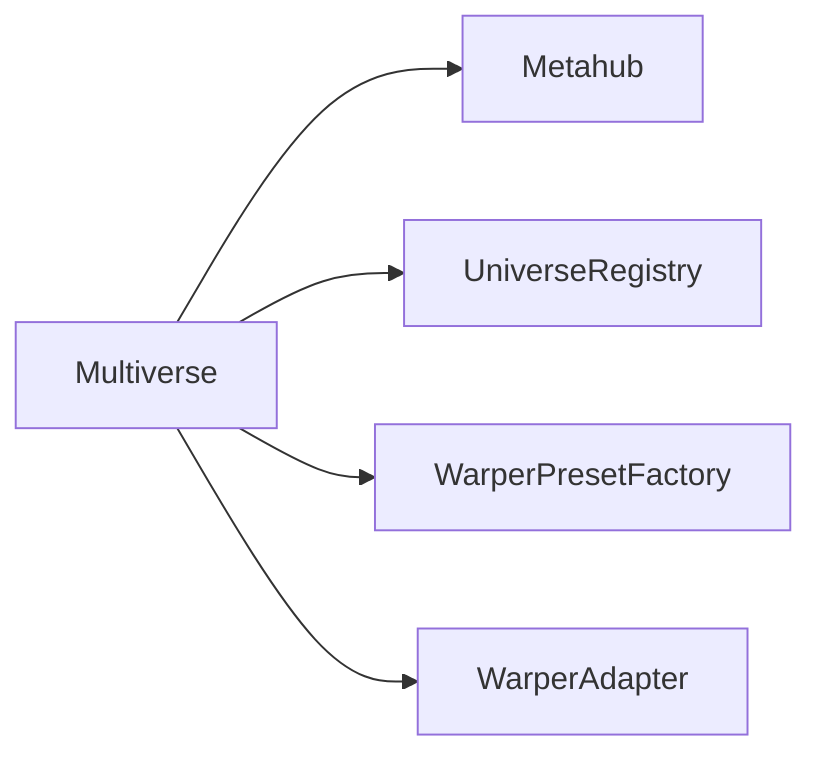

# Multiverse NFT Renting

[](https://github.com/iqlabsorg/iq-sdk-js/actions/workflows/main.yml)

This package is part of [IQ Protocol JS SDK.](https://github.com/iqlabsorg/iq-sdk-js)

| :exclamation: The package is in development and breaking changes should be expected. Use at your own risk! |
| :--------------------------------------------------------------------------------------------------------- |

This package provides higher level abstraction over IQ Protocol smart contracts, allowing application developers to work with IQ NFT renting platform regardless of the underlying blockchain.

Use this package to create IQVerse, deploy Warper and communicate with Metahub to implement NFT listing & renting
functionality.

## Installation

This package requires [ethers.js](https://github.com/ethers-io/ethers.js) peer dependency, so it needs to be installed too.

```bash
yarn add @iqprotocol/multiverse ethers
```

## Usage

Start with `Multiverse` client initialization. Then you can use the client to resolve adapters for various
contracts.

### Multiverse

The architecture consists of the main entrypoint, which we call `Multiverse`. To be able to interact with the rest of the SDK, one needs to instantiate the `Multiverse` instance.

#### Initialization

You need to provide a [Signer](https://docs.ethers.io/v5/api/signer/#Signer) which suits your use-case. For example, `VoidSigner` will be enough for reading data, but for listing, renting and other state-changing operations you need a signer, with private key.

```ts
import { Multiverse } from '@iqprotocol/multiverse';
import { ethers } from 'ethers';

const provider = new ethers.providers.JsonRpcProvider('<RPC URL>');
const accountAddress = '0x...';

const multiverse = await Multiverse.init({
  signer: new VoidSigner(accountAddress, provider),
});
```

After the Multiverse has been instantiated, it can be used to resolve other crucial adapters of the SDK.



#### Chain ID

Since IQ Protocol SDK is made to be used for interacting with contracts deployed on various blockchains, it is crucial to make sure the correct contract addresses and asset identifiers are used. Therefor the SDK relies on [CAIP](https://www.npmjs.com/package/caip) standard identifiers for referencing accounts and assets. Often you will need to know the chain ID to construct such identifiers.

```ts
const chainId = await multiverse.getChainId();
```

### Universe (IQVerse)

In order to create and manage your IQVerse you will need to use the `UniverseRegistryAdapter`.

```ts
import { AccountId, ChainId } from '@iqprotocol/multiverse';

const universeRegistryAddress = '0x...';
const universeRegistry = multiverse.universeRegistry(
  new AccountId({
    chainId,
    address: universeRegistryAddress,
  }),
);
```

#### Creation

A crucial part of the IQProtocol ecosystem is the ability to create and manage your own IQVerse. Each IQVerse has its own unique identifier, which is used to reference it in the universe registry. It is important for you to make sure that you do not _forget_ the universe ID.

```ts
// Create a new universe
const tx = await universeRegistry.createUniverse({
  name: 'My IQVerse',
  rentalFeePercent: 500, // NOTE: 100 is 1%, 10_000 is 100%.
});

// Retrieve the event that has encoded the universe ID
const universeCreatedEvent = await universeRegistry.findUniverseByCreationTransaction(tx.hash);

// Log the universe ID
const universeId = universe!.universeId;
```

### Warper

In order to deploy a warper from a preset you will need to use the `WarperPresetFactoryAdapter`.

```ts
import { AccountId, ChainId } from '@iqprotocol/multiverse';

// Resolve WarperPresetFactoryAdapter.
const warperPresetFactoryAddress = '0x...';
const warperPresetFactory = multiverse.warperPresetFactory(
  new AccountId({
    chainId,
    address: warperPresetFactoryAddress,
  }),
);
```

#### Warper preset deployment

"Preset factories" allow you to easily deploy warpers from presets. These presets are created and maintained by the IQ Protocol team.

```ts
// Deploy ERC721PresetConfigurable preset.
const presetId = 'ERC721PresetConfigurable';
const metahubAddress = '0x...';
const originalAssetAddress = '0x...';

const tx = await warperPresetFactory.deployPreset(presetId, {
  metahub: new AccountId({
    chainId,
    address: metahubAddress,
  }),
  original: new AssetType({
    chainId,
    assetName: {
      namespace: 'erc721',
      reference: originalAssetAddress,
    },
  }),
});

// Wait for TX confirmation.
await tx.wait();

// Find out the deployed warper reference.
const warperAssetType = await warperPresetFactory.findWarperByDeploymentTransaction(tx);
const warperAddress = warperAssetType!.assetName.reference;
```

### Metahub

In order to interact with the Metahub, it will need to be resolved from the Multiverse.

```ts
import { AccountId, ChainId } from '@iqprotocol/multiverse';

const metahub = multiverse.metahub(
  new AccountId({
    chainId,
    address: metahub.address,
  }),
);
```

#### Custom Warper registration

Anyone can create a custom warper and register it in the Metahub. Please refer to the code snippet below for more details for how to exactly register a custom warper to Metahub. The code snippet assumes that the custom Warper has already been deployed.


```ts
const warperAddress = '0x...';

await metahub.registerWarper(
  new AssetType({
    chainId,
    assetName: { namespace: 'erc721', reference: warperAddress },
  }),
  {
    universeId: '<your universe ID>',
    name: 'My Warper',
    paused: false,
  },
);
```

#### List asset

To list an asset for rent, there must be at least one IQVerse with a registered Warper for the given Original:

```ts
import { BigNumber } from 'ethers';
import { ERC721__factory } from '../typechain';

// Set Metahub as the operator of the token.
const originalNftAddress = '0x0...'
const nft = new ERC721__factory(signer).attach(originalNftAddress);
const setApprovalTx = await nft.setApprovalForAll(args.metahub, true);
console.log(`Setting Metahub approvals. Tx: ${setApprovalTx.hash}`);
await setApprovalTx.wait();
console.log(`Metahub is now the original collection operator.`);

// List the token
const tokenId = 42;
const tx = await metahub.listAsset({
  asset: {
    id: new AssetId({
      chainId,
      assetName: {
        namespace: 'erc721',
        reference: originalNftAddress,
      },
      tokenId: tokenId.toString(),
    }),
    // The amount of tokens. For ERC721 this is always 1. For other token standards - it can differ.
    value: 1,
  },
  strategy: {
    // One of the listing strategies must be chosen. The simplest one - 'FIXED_PRICE'
    name: 'FIXED_PRICE',
    data: {
      price: BigNumber.from(777),
    },
  },
  // The maximum amount of time the asset owner can wait before getting the asset back.
  maxLockPeriod: BigNumber.from(99604800),
  // Whether or not the lister will receive the funds immediately on rent, or
  // will let the funds accumulate on the protocol before withdrawing them.
  immediatePayout: true,
});
console.log(`Tx ${tx.hash}`);
```

#### View listings

After an asset has been listed, you can view the listings of the asset.

```ts

// If we know the ID of a listing, we can retrieve the whole Listing structure
const listing = await metahub.listing(15);

// If we want to enumerate ALL listings, then we can use the `listings` method to paginate it.
// The following code will fetch the first 20 listings.
const listings = await metahub.listings(0, 20);

// If we want to see all listings for a specific asset, we can use the `listingsForAsset` method.
// The following code will fetch the 20 listings with an offset of 5 initial ones for the given user.
const listerAddress = '0x0...';
const userListings = await metahub.userListings(
  new AccountId({
    chainId,
    address: listerAddress,
  }),
  5,
  20,
);

// If we want to see all listings for a specific asset, we can use the `listingsForAsset` method.
// The following code will fetch the 20 listings with an offset of 4 initial ones for the given asset.
const originalAssetAddress = '0x0...';
const assetListings = await metahub.assetListings(
  new AssetType({
    chainId,
    assetName: {
      namespace: 'erc721',
      reference: originalAssetAddress,
    },
  }),
  4,
  20,
);
```

#### Delist asset

To be able to delist an asset, we need to know the listing ID beforehand.


```ts
const listingId = 15;
await metahub.delistAsset(listingId);
```
#### Withdraw asset

To be able to withdraw an asset, we need to know the listing ID beforehand, and the asset needs to be delisted beforehand.

```ts
const listingId = 15;
await metahub.withdrawAsset(listingId);
```

#### Pause Warper

To pause a warper, the warper, of course needs to be registered and NOT PAUSED.

```ts
const warperAddress = '0x0...';
await metahub.pauseWarper(
  new AssetType({
    chainId,
    assetName: {
      namespace: 'erc721',
      reference: warperAddress,
    },
  }),
);
```


#### Unpause Warper

To unpause a warper, the warper, of course needs to be registered and PAUSED.

```ts
const warperAddress = '0x0...';
await metahub.unpauseWarper(
  new AssetType({
    chainId,
    assetName: {
      namespace: 'erc721',
      reference: warperAddress,
    },
  }),
);
```

#### Rent

```ts
// Retrieve the base token used as a rent payment.
const baseToken = await metahub.baseToken();

// Estimate the rental costs
const listingId = 15; // Assume that this is the listing ID of the asset we want to rent.

// Prepare asset types and account structures.
const renterAddress = '0x0...';
const renter = new AccountId({ chainId, address: renterAddress });

const warperAddress = '0x0...';
const warperAsset = new AssetType({
  chainId,
  assetName: {
    namespace: 'erc721',
    reference: warperAddress,
  },
});

// Estimate rental costs.
const rentalParams = {
  listingId: listingId,
  rentalPeriod: rentalPeriod,
  paymentToken: baseToken.type,
  renter: renter,
  warper: warperAsset,
};
const estimation = await metahub.estimateRent(rentalParams);

// Perform the actual rental
tx = await metahub.rent({ ...rentalParams, maxPaymentAmount: estimation.total });

// Wait for the rental transaction to succeed
await tx.wait()
```

#### View rentals

```ts
// To get an individual rental, we can use the `rentalAgreement` method.
// The rental Id needs to be known beforehand.
const rentalId = 15;
const rentalAgreement = await metahub.rentalAgreement(rentalId);

// To get all rentals for a specific user, we can use the `userRentalAgreements` method.
// The function takes an account ID and an offset and a limit to paginate the results.
const renterAddress = '0x0...';
const renter = new AccountId({ chainId, address: renterAddress });
const userRentalAgreement = await metahub.userRentalAgreements(renter, 0, 20);
```

#### View warpers

```ts
// if the Warper is already known, we can use the `warper` method.
const warperAddress = '0x0...';
const warperAsset = new AssetType({
  chainId,
  assetName: {
    namespace: 'erc721',
    reference: warper.address,
  },
});
const registeredWarper = await metahub.warper(warperAsset);

// If we want to enumerate all warpers and we know the original asset, we can use the `assetWarpers` method.
const originalAddress = '0x0...';
const originalAsset = new AssetType({
  chainId,
  assetName: {
    namespace: 'erc721',
    reference: originalAddress,
  },
});
const registeredWarpersForAsset = await metahub.assetWarpers(originalAsset, 0, 20);

// If we want to enumerate all warpers and we know the universe ID, we can use the `universeWarpers` method.
const universeId = 1;
const registeredWarpersForUniverse = await metahub.universeWarpers(universeId, 0, 20);
```

#### Withdraw user earnings

Withdrawing funds is only possible if the user has earned some, and the listing DID NOT specify `immediatePayout` (meaning that funds had accumulated on the actual contract).


```ts
// the token we want to withdraw
const baseToken = await metahub.baseToken();

// The amount we want to withdraw
const amount = 100;

// The account we want to withdraw TO
const toAddress = '0x0...';
const to = new AccountId({ chainId, address: toAddress });

// Perform the withdrawal
await metahub.withdrawFunds(baseToken.type, amount, to);

```

#### Withdraw universe earnings

When rentals happen in a given universe, part of the rental fee actually goes to the said IQverse.

```ts
// Assume we know the universe ID.
const universeId = 1;

// the token we want to withdraw
const baseToken = await metahub.baseToken();

// The amount we want to withdraw
const amount = 100;

// The account we want to withdraw TO
const toAddress = '0x0...';
const to = new AccountId({ chainId, address: toAddress });

// Perform the withdrawal
await metahub.withdrawUniverseFunds(universeId, baseToken.type, amount, to);
```
